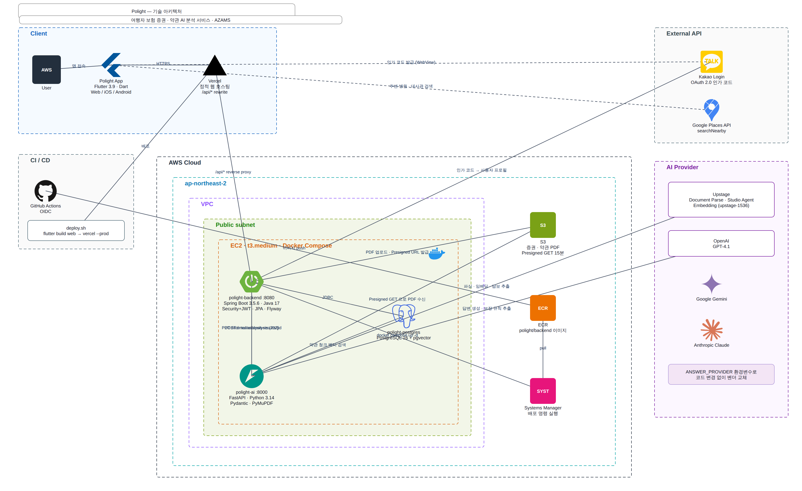
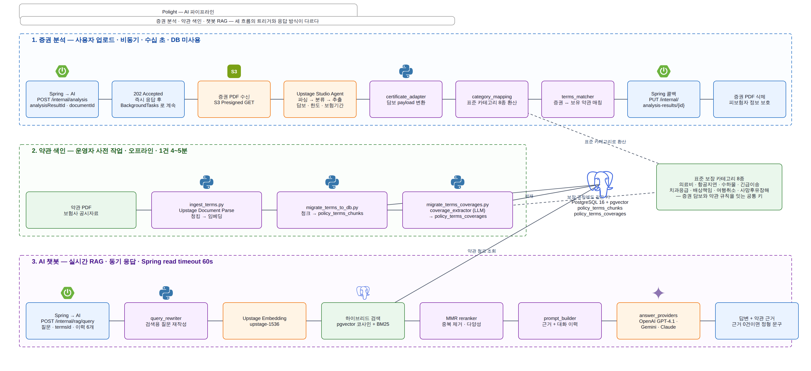
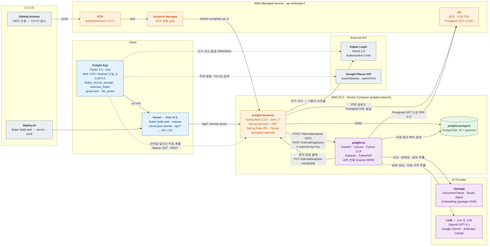
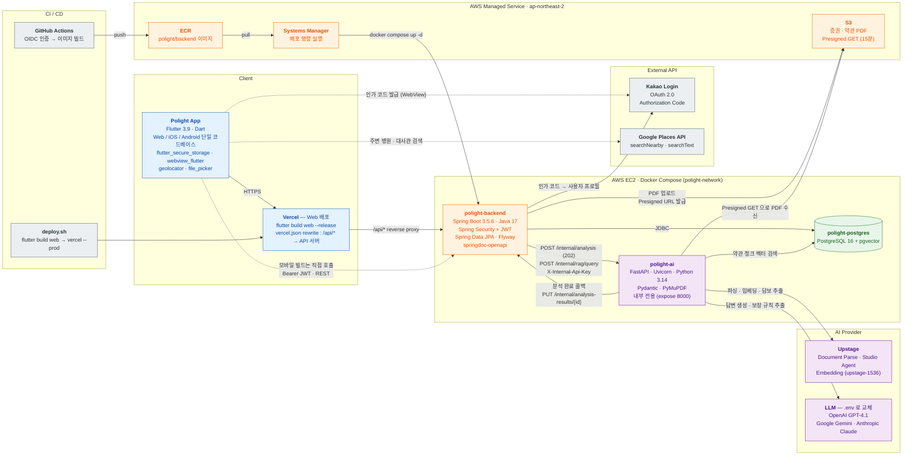
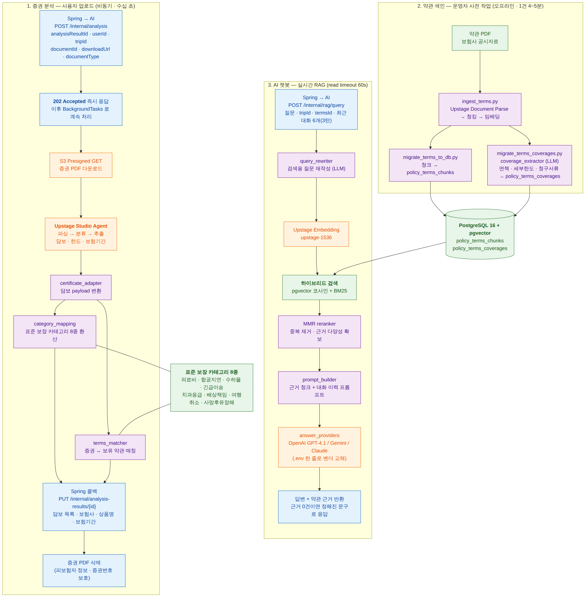
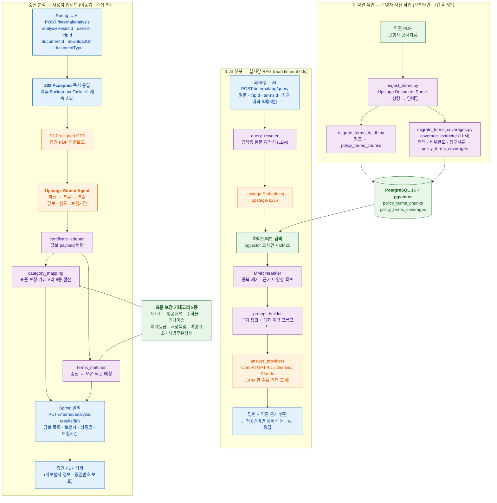

# Polight 기술 아키텍처 다이어그램

3개 레포(`Polight-frontend` · `Polight-Server` · `polight-ai`)의 실제 설정 파일
(`pubspec.yaml` · `vercel.json` · `build.gradle` · `application.yaml` ·
`docker-compose.prod.yml` · `requirements.txt`)에서 확인한 스택으로 작성했다.

## 무엇을 쓰면 되는가

| 용도 | 파일 |
| --- | --- |
| **발표·문서용 (권장)** | `polight-architecture.drawio` — 실제 기술 로고 + AWS 아이콘. draw.io 로 열어 편집·내보내기 |
| GitHub 에서 바로 보기 | 이 문서 아래의 Mermaid 블록 |
| 텍스트로 diff 를 보고 싶을 때 | `overview.mmd` · `ai-pipeline.mmd` |

| 파일 | 내용 |
| --- | --- |
| `polight-architecture.drawio` | 탭 2개 — **전체 아키텍처** / **AI 파이프라인**. 로고는 파일에 임베드되어 있어 오프라인에서도 그대로 보인다 |
| `overview.drawio.png` · `ai-pipeline.drawio.png` | 위 파일의 **배치 미리보기**. 좌표·라벨 확인용이며, 선은 직선으로만 그렸다. 최종 이미지는 draw.io 에서 내보낸다 |
| `overview.mmd` · `ai-pipeline.mmd` | 같은 내용의 Mermaid 소스 |
| `overview.png` · `ai-pipeline.png` | Mermaid 를 렌더링한 이미지 |
| `tools/` | 두 다이어그램을 생성하는 스크립트 (좌표·스타일이 코드로 선언돼 있어 수정·재생성이 쉽다) |

## draw.io 로 여는 방법

1. [app.diagrams.net](https://app.diagrams.net) → **File → Open from → Device** → `polight-architecture.drawio`
2. 아래쪽 탭으로 **전체 아키텍처 / AI 파이프라인** 전환
3. 내보내기: **File → Export as → PNG** (배율 2~3배, *Transparent* 끄기)

### 편집할 때 알아둘 것

- **그룹이 실제로 중첩돼 있다.** `AWS Cloud → Region → VPC → Public subnet → EC2` 순서로
  부모-자식이라, VPC 를 옮기면 안에 든 컨테이너가 같이 움직인다.
- **AWS 아이콘은 draw.io 내장 스텐실**(`mxgraph.aws4.*`)이다. 다른 서비스로 바꾸려면
  도형을 우클릭 → *Edit Style* 에서 `resIcon=mxgraph.aws4.<서비스>` 만 고치면 된다.
- **기술 로고는 SVG 가 파일에 임베드**되어 있다(퍼센트 인코딩 data URI). 외부 링크가 아니라
  네트워크 없이도 보이고, 로고를 바꾸려면 이미지를 교체하면 된다.
- 다시 생성하려면: `cd tools && node icons.js && python3 buildall.py`

## 로고 포함 다이어그램

### 전체 아키텍처

### AI 파이프라인

> 위 두 이미지는 배치 확인용 미리보기다. AWS 아이콘과 곡선 라우팅이 들어간 최종 그림은
> `polight-architecture.drawio` 를 draw.io 에서 열어 내보낸다.

## 스택 요약

| 레이어 | 기술 |
| --- | --- |
| 클라이언트 | Flutter 3.9 · Dart (Web / iOS / Android 단일 코드베이스), `flutter_secure_storage`, `webview_flutter`, `geolocator`, `file_picker` |
| 웹 배포 | Vercel — `flutter build web --release` + `vercel.json` 의 `/api/*` rewrite |
| 백엔드 | Spring Boot 3.5.6 · Java 17 · Spring Security + JWT(jjwt) · Spring Data JPA · Flyway · springdoc-openapi · AWS SDK for S3 |
| AI 서버 | FastAPI · Uvicorn · Python 3.14 · Pydantic · PyMuPDF · LangChain |
| 데이터 | PostgreSQL 16 + pgvector (`pgvector/pgvector:pg16` 컨테이너) |
| 파일 저장 | S3 (증권·약관 PDF, Presigned GET 15분) |
| 인증 | Kakao OAuth 2.0 Authorization Code → 서비스 JWT (만료 1시간) |
| 외부 API | Upstage(Document Parse · Studio Agent · Embedding), OpenAI GPT-4.1, Google Gemini, Anthropic Claude, Google Places API |
| 인프라 | AWS EC2(단일 인스턴스) · Docker Compose · `polight-network` 로 컨테이너 간 통신 |
| CI/CD | 백엔드: GitHub Actions → OIDC → ECR Push → SSM RunShellScript → `docker compose up -d` / AI: 호스트에서 이미지 빌드 후 별도 compose / 프론트: `deploy.sh` → `vercel --prod` |

## 서비스 간 통신

| 구간 | 내용 |
| --- | --- |
| 클라이언트 → 백엔드 | 웹은 Vercel `/api/*` rewrite 경유, 모바일 빌드는 직접 호출. `Authorization: Bearer {JWT}` |
| 백엔드 → AI | `POST /internal/analysis` (202 즉시 응답) · `POST /internal/rag/query` (read timeout 60s). 공유 시크릿 `INTERNAL_API_KEY` |
| AI → 백엔드 | `PUT /internal/analysis-results/{id}` 분석 완료/실패 콜백 |
| AI → S3 | 백엔드가 발급한 Presigned GET URL 로 PDF 수신 |
| 컨테이너 간 | Docker 네트워크 이름으로 통신(`polight-backend:8080`, `polight-ai:8000`, `postgres:5432`). AI 서버는 호스트 포트를 열지 않는다 |

## 배포를 두 compose 로 나눈 이유

AI 서버의 분석 작업은 응답을 보낸 뒤에도 `BackgroundTasks` 로 3~4분간 계속 돈다.
같은 compose 에 두면 백엔드를 배포할 때마다 AI 컨테이너가 재시작되어 진행 중인 분석이
사라지고 콜백을 못 보내 `analysis_results` 가 `PROCESSING` 에 고착된다.
그래서 네트워크만 공유하고 compose 프로젝트는 분리했다.

---

## Mermaid 버전

draw.io 없이 GitHub 에서 바로 보거나, 텍스트로 관리하고 싶을 때 쓴다.

## 1. 전체 시스템 아키텍처

## 2. AI 파이프라인

세 흐름의 성격이 다르다.

| 흐름 | 트리거 | 특징 |
| --- | --- | --- |
| 증권 분석 | 사용자 업로드 | 비동기(202 + 콜백). 수십 초. DB 미사용. 담보 추출은 Upstage Studio Agent 가 담당 |
| 약관 색인 | 운영자 사전 작업 | 오프라인 스크립트. 1건 4~5분. 결과를 pgvector 에 적재 |
| 챗봇 RAG | 사용자 질문 | 동기 응답. 하이브리드 검색(벡터+BM25) → MMR → LLM |

증권의 담보와 약관의 보장 규칙은 **표준 보장 카테고리 8종**을 공통 키로 연결된다.
